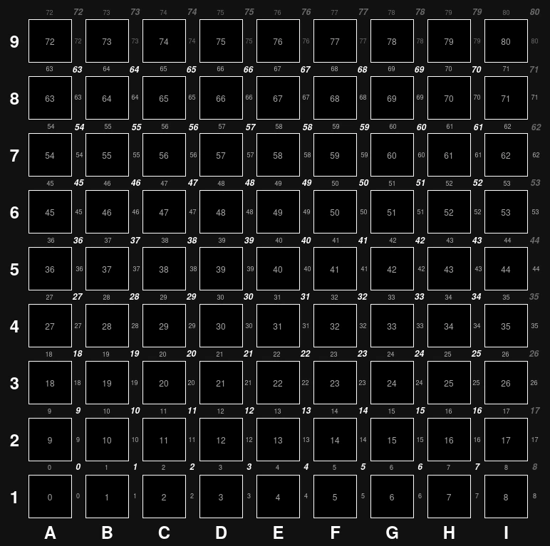

# Quoridor implementation

Quoridor is a game where the goal is to be the first player to walk their pawn to the opposite side. Each turn you can either move your pawn or place a wall. Each player can place 10 walls, but there always needs to be a route for each pawn to reach the opposite side.

This repository contains code related to playing Quoridor.

Eventually I want the following functionality:

- Visual user interface where players can:
    - Play against each other
    - Play against quoridor engines
    - Let their own developed engines play against other developers engines
    - Play Quoridor puzzles
    - Analyze quoridor game play

- A quoridor core library that can be used in engines and through wasm that:
    - Keeps board / game state
    - Possible moves
    - Move legality
    - Game finished status
        - A game is finished when either player has reached the opposite side
        - Either player has resigned
        - Either player has run out of time

- A game engine that gives the "best" moves to play

- An analysis tool that to step through finished games and analyse how close they where to optimal play / where there were big missed oppurtunities etc. 

## User interface

Clean and simple, lichess is a major inspiration, show the following in game: 
- pawns, 
- the placed walls 
- the left over walls per player
- who's turn
- the time left per player
- the column and row names
- highlight the last move
- when clicking or holding a pawn -> the possible moves with the pawn
- when hovering a wall placement -> if the placement is legal (this might be hard since each wall position will require path finding to determine legality)
- a history of moves up till that point with options to step through
- option to resign
- when playing the computer option to take back move
- when playing other player, the connection status

## Quoridor-core library

The core contains boardstate and gamestate: 

The boardstate only contains a singel state of the board and should be easy to copy over for stuff like Monte Carlo Tree Search (MCTS). On a state it should be possible to get possible moves for a player, should maybe be split into pawn move and wall move, execute a move for a player (returning a new boardstate when legal), and maybe execute a random move (I need to look into MCTS a bit more again).

The gamestate contains the game_id, the current boardstate, the active player, the previous moves, the time left for each player, finished status (who won and how).

### Boardstate

A quoridor board is made up off 9 by 9 squares, the walls are placed in between and are two squares long. The ["official" quoridor notation](https://quoridorstrats.wordpress.com/notation/) uses letters a to i for the x axis and numbers 1 to 9 for the y axis. The starting position of the white pawn is e4 and the black pawn starts at e9. For walls the coordinate corresponds with the center off the wall, and each wall also includes the letter v or h to say if the wall is oriented vertical or horizontal.

To store the boardstate in memory each square has it's own number ranging from 0 to 80, so the position of a pawn can be represented as an u8. The walls are represented by an array of length 71 with `Option<WallOrientation>`. The array starts out empty (filled with None values), when a wall is placed it becomes a Some() with the enum describing the orientation for the wall. 

To make path finding faster, the edges between each node (the square) are stored. This is split up in a bitset with horizontal and vertical edges, where a bit set to true means there is a wall. This makes indexing into the edges to see if a move is possible simple since it is either the number of the square (going right or up), or the number of the square minus one (going left or down).

This feels like it balances ease of use with size in memory. The `std::mem::size_of` method shows the whole structure is 128 bytes, but I don't think this is correct, since the capacity of the FixedBitSet is only set later. A lot of the space is used for the array storing the walls 'Option<WallOrientation>', since each value is using an entire byte to store information that could essentially be stored in 2 bits. At a later stage it could be interresting to play with shrinking the size of this, since I think that could benefit MCTC.